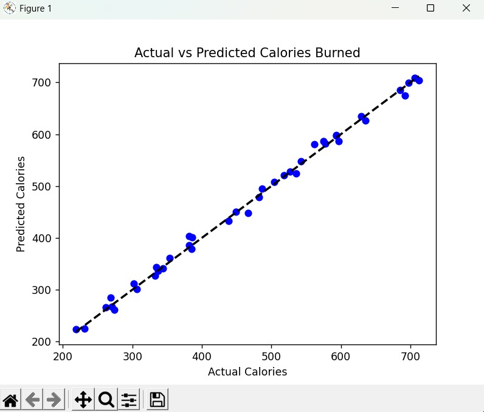

# 🏋️‍♂️ CalorieGuard: AI-Powered Fitness Insights

## 📌 Problem Statement
Many fitness enthusiasts struggle to quantify the effectiveness of their workouts. This project uses **Multiple Linear Regression** to accurately predict caloric burn based on physiological and activity data, providing a tool for better workout optimization.

## 🚀 How to Run
1. **Clone the repository:** `git clone [Your-Repo-Link]`
2. **Install requirements:** `pip install -r requirements.txt`
3. **Execute the model:** `python main.py`

## 🛠️ Tech Stack
- **Language:** Python
- **Libraries:** Pandas, Scikit-Learn, Matplotlib, NumPy
- **Model:** Linear Regression

## 📊 Results & Visualization
The model successfully identifies a strong linear relationship between workout duration, heart rate, and energy expenditure.

 

## 🧠 Key Learnings
- Understanding the impact of data scaling on regression models.
- Handling binary library incompatibilities (NumPy/Pandas versioning).
- Implementing a full ML pipeline from data generation to evaluation.
